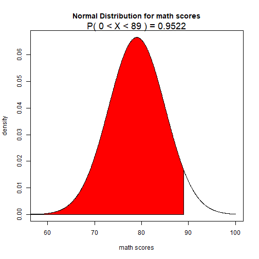

Developing Data Products Peer Assignment 2
========================================================
Author: Minki Jo
Date: Jan. 27, 2018


Infer the Status of Math Score in a class
========================================================
This presentation shows how normal distribution can predict 
the status when you know average and standard deviation of population

Also, it shows the difference between normal distribution N(mu, sigma) and
standard normal distribution N(0,1)

In order to understand easy, assume the input values as a math score
In the end, you can infer your status of the class in math in terms of 
any average and standard deviation of your class.


User input and output
================================================================
This application has three user inputs :  
1) average math score of your class (default: 70 pts)  
2) standard deviation of math score (default: 5 pts)  
3) slidebar that can be adjusted for the range you want to know  

Click the check box if you like to transform into standard normal distribution N(0,1)

This application produces probability of the score range

Relevant Code 
================================================================
what is your status when you got 89 points (avg:79, sd:6 in class)


```r
mean=79; sd=6
pts <- seq(-3.5, 3.5, length=1000)*sd +mean  # -3.5 std dev to +3.5 std dev and no more than 100 points
den <- dnorm(pts,mean,sd)
plot(pts, den, type="l", xlab="math scores", ylab="density", main="Normal Distribution for math scores")
low_pts <- 0 ; high_pts <- 89
range <- pts >= low_pts & pts <= high_pts
polygon(c(low_pts,pts[range],high_pts), c(0,den[range],0), col="red")
prob <- pnorm(high_pts, mean, sd) - pnorm(low_pts, mean, sd)
result <- paste("P(",low_pts,"< X <",high_pts,") =", round(prob, 4))
mtext(result, 3, cex=1.5, font=1)       
```




Resources
========================================================
In order to activate the shiny application,
visit <https://wizmj.shinyapps.io/distribution/>

For the source code for the shiny application,
visit github <  >
